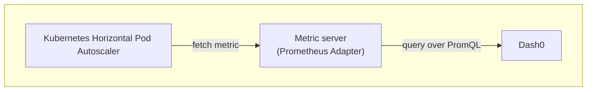
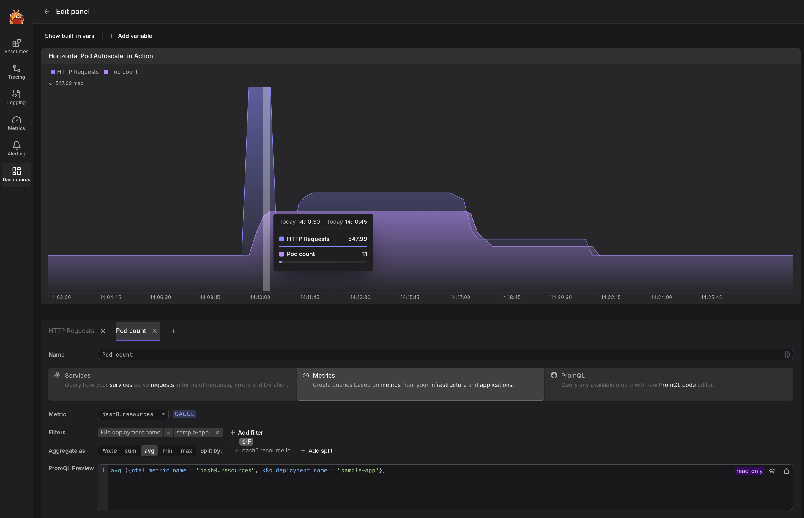

# Dash0 + Horizontal Pod Autoscaling Example

This project shows how to set up Kubernetes' [Horizontal Pod Autoscaling](https://kubernetes.io/docs/tasks/run-application/horizontal-pod-autoscale/) to operate based on metric data coming from Dash0's PromQL endpoint.

## Overview

From Kubernetes' documentation, a [Horizontal Pod Autoscaler (HPA)](https://kubernetes.io/docs/tasks/run-application/horizontal-pod-autoscale/):

> automatically updates a workload resource (such as a Deployment or StatefulSet), with the aim of automatically scaling the workload to match demand.

The horizontal pod autoscaler can use utilixzation metrics built-in in the cluster.
But there are types of workloads like Java or .NET that, when well configured CPU and memory utilization of a carefully sized and well-tuned application is not much distinguishable from an under-resourced one.

Application-level metrics, like latency or error rate, are often good (if not outright better!) options to automatically scale up or down an application.

For these scenarios, the horizontal pod autoscaler can query [custom metrics](https://kubernetes.io/docs/tasks/run-application/horizontal-pod-autoscale/#scaling-on-custom-metrics).
And the [Prometheus adapter](https://github.com/kubernetes-sigs/prometheus-adapter) provdes a bridge between the metrics API that Kubernetes expects, and a PromQL endpoint.
Like, you know, [Dash0's](https://dash0.com/) ;-)

In a nutshell, the outlook of the integration is as follows:



Besides, there are other types of autoscalers in Kubernetes you are likely to come across.
The [vertical pod autoscaler](https://kubernetes.io/docs/concepts/workloads/autoscaling/#scaling-workloads-vertically) allows you to change pod templates to have access to more or less CPU and memory.
The [cluster autoscaling](https://kubernetes.io/docs/concepts/cluster-administration/cluster-autoscaling/) allows you to add or remove nodes from your cluster.
And the [Kubernetes Event-driven Autoscaling](https://keda.sh/) is based on events, as opposed to metrics like the other autoscalers.

**Note:** This example is based on the [Prometheus adapter walkthrough](https://github.com/kubernetes-sigs/prometheus-adapter/blob/master/docs/walkthrough.md).
The only bit that required a bit of figuring out is out to pass the Dash0 Auth token through the Helm chart of the Prometheus adapter and to the Prometheus adapter itself.
This is the kind of awesomeness you get when your observability tool is built on and for open standards :-)

## Setup

**Before you start:** Log into Dash0 and grab yourself an [auth token](https://www.dash0.com/documentation/dash0/key-concepts/auth-tokens).
In the reminder, replace `$DASH0_AUTH_TOKEN` with the value of the auth token.

### Install Minikube

In this walkthrough was written using [`minikube`](https://minikube.sigs.k8s.io/docs/) as a local, small cluster.
There _should_ be no differences with other flavors of Kubernetes, both those that run on your machine like [Docker Desktop](https://www.docker.com/products/docker-desktop/), [Microk8s](https://microk8s.io/), or those that you run in your datacenter or in the Clouds.

Using `minikube`:

```sh
minikube start
```

(Depending on your minikube settings, and specifically how much memory and CPU you want to give to it, you may need to [add more memory](https://minikube.sigs.k8s.io/docs/start))

### Install the Prometheus Adapter

**IMPORTANT:** You will need to replace the values of `$DASH0_BASE_URL` and `$DASH0_AUTH_TOKEN` in the following command:

Install the [Prometheus Adapter for Kubernetes Metrics APIs](https://github.com/kubernetes-sigs/prometheus-adapter):

```sh
helm repo add prometheus-community https://prometheus-community.github.io/helm-charts
helm repo update
helm upgrade --install -n monitoring --create-namespace prometheus-adapter prometheus-community/prometheus-adapter --values=./sample-app/adapter-helm-values.yaml --set "prometheus.url=$DASH0_BASE_URL" --set "extraArguments[0]=--prometheus-header=Dash0-Dataset=default" --set "extraArguments[1]=--prometheus-header=Authorization=Bearer $DASH0_AUTH_TOKEN"
```

Starting ther adapter takes... a while.
(On my machine it takes about 2 minutes; your mileage may vary.)
Wait until the this command returns something like the following:

```sh
$ kubectl get --raw /apis/custom.metrics.k8s.io/v1beta1
{"kind":"APIResourceList","apiVersion":"v1","groupVersion":"custom.metrics.k8s.io/v1beta1","resources":[]}
```

Create the APIService:

```sh
kubectl apply -f sample-app/metrics-apiservice.yaml
```

### Deploying a Sample Application

Deploying a sample app:

```sh
kubectl create -f sample-app/deployment.yaml
kubectl create -f sample-app/service.yaml
```

Expose the application on localhost so that we can curl it:

```sh
minikube service sample-app --url
```

Deploy the Dash0 operator to scrape the `/metrics` endpoint of the app following the instructions in the [Dash0 onboarding](https://app.dash0.com/onboarding/instructions/k8s/dash0-k8s-operator):

**IMPORTANT:** You will need to replace the value of `$DASH0_AUTH_TOKEN` and `$DASH0_INGRESS_ENDPOINT` in the following. Get the correct settings at https://app.dash0.com/onboarding/instructions/k8s/dash0-k8s-operator.

```sh
# The auto token and ingestion endpoint depend on your Dash0 organization
# Get the correct settings at https://app.dash0.com/onboarding/instructions/k8s/dash0-k8s-operator
helm repo add dash0-operator https://dash0hq.github.io/dash0-operator
helm repo update dash0-operator
kubectl create namespace dash0-system
kubectl create secret generic dash0-authorization-secret --namespace dash0-system --from-literal=token=$DASH0_AUTH_TOKEN
helm upgrade --install \
  --namespace dash0-system \
  --set operator.dash0Export.enabled=true \
  --set operator.dash0Export.endpoint=$DASH0_INGRESS_ENDPOINT \
  --set operator.dash0Export.secretRef.name=dash0-authorization-secret \
  --set operator.dash0Export.secretRef.key=token \
  dash0-operator \
  dash0-operator/dash0-operator
```

Then create this resource:

```yaml
apiVersion: operator.dash0.com/v1alpha1
kind: Dash0Monitoring
metadata:
  name: dash0-monitoring-resource
```

### Configure the Horizontal Pod Autoscaler

Register HPA settings:

```sh
kubectl apply -f sample-app/hpa.yaml
```

Validate that the `http_requests` metric is correctly registered for pods:

```sh
$ kubectl get --raw /apis/custom.metrics.k8s.io/v1beta2
{"kind":"APIResourceList","apiVersion":"v1","groupVersion":"custom.metrics.k8s.io/v1beta2","resources":[{"name":"pods/http_requests","singularName":"","namespaced":true,"kind":"MetricValueList","verbs":["get"]},{"name":"namespaces/http_requests","singularName":"","namespaced":false,"kind":"MetricValueList","verbs":["get"]}]}
```

You can also check what the horizontal pod autoscaler will see as values for the `http_requests` metric by running:

```sh
$ kubectl get --raw "/apis/custom.metrics.k8s.io/v1beta2/namespaces/default/pods/*/http_requests?selector=app%3Dsample-app"
{"kind":"MetricValueList","apiVersion":"custom.metrics.k8s.io/v1beta2","metadata":{},"items":[{"describedObject":{"kind":"Pod","namespace":"default","name":"sample-app-64bc55c897-r5nmt","apiVersion":"/v1"},"metric":{"name":"http_requests","selector":null},"timestamp":"2024-12-10T14:04:50Z","value":"2"}]}
```

### Turn up the heat!

My favorite way to generate a _large_ amount of requests towards a local application with an HTP API is to point a shell looping on `curl`.
The URL we need to query is not exposed outside of the Kubernetes cluster by default.
Normally, you would setup an ingress controller to expose to outside the cluster your workloads.
But for the `minikube` setup, there's a simpler way:

```sh
$ minikube service sample-app --url
😿  service default/sample-app has no node port
❗  Services [default/sample-app] have type "ClusterIP" not meant to be exposed, however for local development minikube allows you to access this !
http://127.0.0.1:51535
❗  Because you are using a Docker driver on darwin, the terminal needs to be open to run it.
```

**Note:** You may want to run the command above in another terminal, as likely you will lose access to the API if you terminate the command.

**IMPORTANT:** Mind the port of the `http://127.0.0.1:51535` URL above, yours is likely to be different!

And then, time to open the firehose:

```sh
while true; do curl http://127.0.0.1:51535; done
```

**Note:** This is another command you should likely run in a different shell.

As you inundate of requests the sample application, you can check what the horizontal pod autoscaler is doing, run:

```sh
$ kubectl get hpa -w
NAME         REFERENCE               TARGETS       MINPODS   MAXPODS   REPLICAS   AGE
sample-app   Deployment/sample-app   9508158m/50   1         10        4          33m
sample-app   Deployment/sample-app   9508158m/50   1         10        8          33m
sample-app   Deployment/sample-app   9508158m/50   1         10        10         33m
sample-app   Deployment/sample-app   679999m/50    1         10        10         34m
```

### See it in Dash0

In Dash0 you can create dashboards (and check rules and more!) using powerful, simple query builders.

For example this Dashboard panel shows how the horizontal pod autoscaler was scaling up the pods of the sample application from the original one replica, to nine:



Notice how the horizontal pod autoscaler was delayed in its reaction.
I left the load generation on until I saw more pods come online, and immediately turned it off.
Then it took a while with no traffic until the horiozontal pod autoscaler, based on the count of HTTP requests, decided to scale down.
Tweaking the responsiveness of the horizontal pod autoscaler makes whole the difference when you rely on it in production.
Test it exhaustively!
